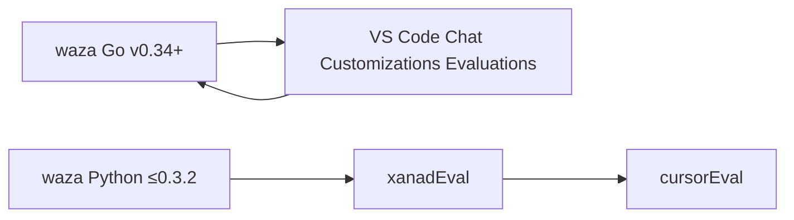

# cursorEval audit — lineage, gaps, and improvements

Audit date: 2026-06-04. Compares **cursorAssistant** `tools/cursorEval/` with **xanadAssistant** `tools/xanadEval/`, **microsoft/waza**, and the **Chat Customizations Evaluations** VS Code extension.

Local xanad sources: `/home/solon/Documents/git/repos/old.git/xanadassistant/` (including `docs/plans/xanadeval-waza-gap-review.md`).

---

## Executive summary

| Question | Answer |
| --- | --- |
| Is waza / VS Code eval already implemented here? | **Partially.** cursorEval is a **deliberate slim fork** of early xanadEval (waza-inspired Python), not a port of waza Go v0.34 or the VS Code extension. |
| Does it benchmark agents/skills/prompts? | **Statically yes** (`check`, `policy`, `coverage`, `validate`). **Dynamically partial** — GitHub Models `run` with mostly `text` graders + per-task `expected` / `expected_absent`. |
| Does it improve content like xanadEval `quality` / `dev`? | **No** — those LLM-as-judge improvement loops were **not ported**. |
| Biggest gap vs xanadEval? | **Strict coverage CI**, **baseline A/B runs**, **trigger_tests** grader — surface audit covered by **`surfaceReview`**. |
| Biggest gap vs waza today? | **Copilot/Cursor live executor**, **baseline A/B**, **trigger_tests**, **dashboard**, **spec compliance depth**. |
| cursorAssistant-specific wins? | **Cursor tool policy**, **11-agent routing evals**, **conflict-matrix routing docs**, **CI integration** without Go binary. |

---

## Lineage



1. **microsoft/waza** — Go CLI for agentskills.io skills (and custom agents). Scaffolds evals, runs benchmarks, `check` against spec, `quality`, `serve` dashboard, many grader types, optional **Copilot SDK** executor ([repo](https://github.com/microsoft/waza), [CLI reference](https://microsoft.github.io/waza/reference/cli/)).

2. **Chat Customizations Evaluations** (`ms-vscode.vscode-chat-customizations-evaluations`) — VS Code extension that wraps waza: **Analyze Prompt** (LLM), **Create Waza Eval Scaffold**, **Run Waza Evaluation** ([Marketplace](https://marketplace.visualstudio.com/items?itemName=ms-vscode.vscode-chat-customizations-evaluations)). Targets `.prompt.md`, `.agent.md`, `SKILL.md`, `.instructions.md` — **Copilot/VS Code**, not Cursor IDE natively.

3. **xanadEval** — Python tool retained in xanadAssistant after waza moved to Go. Documented as inspired by early waza; adds xanad layout (`.agent.md`, `.github/skills/`), **agenticReview** skill, and extended graders (local copy: `old.git/xanadassistant/docs/plans/xanadeval-waza-gap-review.md`).

4. **cursorEval** — Reimplemented for cursorAssistant at v0.10.x ([ROADMAP](ROADMAP.md)): Cursor surfaces (`agents/*.md`, `.cursor/skills/`), **forbidden VS Code tool names** in `policy`, routing-focused live evals.

---

## Command comparison

| Command / capability | waza (Go) | xanadEval | cursorEval |
| --- | --- | --- | --- |
| `list` / discover suites | `run --discover`, `coverage` | via `coverage` | `list` |
| `validate` eval YAML | yes | partial | `validate` |
| `check` surface file | rich spec + advisory | rich (agents + skills) | **basic** (frontmatter, when-to-use, tokens) |
| `tokens` | + `profile`, `suggest` | structural metrics | token count + sections only |
| `suggest` / `new eval` scaffold | `waza new eval` | `suggest` | **missing** |
| `coverage` | full / partial / missing + grader diversity | skill has eval.yaml? | **binary** (suite exists?) |
| `policy` | spec in `check` | Copilot tool names | **Cursor** tool names (`vscode_`, `grep_search`, …) |
| `run` | trials, tags, parallel, cache, baseline | trials, tags, skill inject | single trial, no `--tags`, inject surface |
| `grade` | full grader set | full grader set | `text`, `behavior` only (+ task expectations in `run`) |
| `quality` (LLM 5 dimensions) | `waza quality` | `quality` | **missing** |
| `dev` (improvement hints) | — | `dev` | **missing** |
| `report` HTML | `serve` dashboard | `report` | **missing** |
| `results list/compare/view` | yes | yes | JSON files in `.cursorEval/` only |
| `compare` git ref token diff | — | `compare` | **missing** |
| Live IDE executor | Copilot SDK | GitHub Models only | GitHub Models only |

---

## Grader comparison

**xanadEval** (`_common.py`, `_graders_ext.py`): `text`, `behavior`, `trigger`, `file`, `diff`, `code`, `action_sequence`, `tool_constraint`, `script`, `human`, `skill_invocation`, `llm`, `llm_comparison`, `prompt_judge`, `json_schema`, `program`.

**cursorEval** (`_common.py`): `text`, `behavior`; other types are **skipped** with `"requires runtime or API"`. Per-task `expected` / `expected_absent` are applied in `run` (similar to xanadEval's inline patterns).

**Impact:** cursorEval routing evals work for **keyword/routing** checks (e.g. "use `inventory` not Explore") but cannot validate:

- Trigger precision in isolation (`inject_skill_body: false`)
- File/diff outcomes after agent work
- Tool-call sequences
- LLM-judge rubrics (clarity, anti-patterns)

---

## What cursorEval implements well (keep)

| Area | Detail |
| --- | --- |
| **CI static gate** | `validate`, `coverage`, `policy`, `check` on all core/pack skills and agents (`scripts/ci_check_surfaces.sh`, `.github/workflows/ci.yml`). |
| **Cursor alignment** | `policy` bans legacy VS Code/Copilot tool identifiers; steers authors to Read/Grep/SemanticSearch/Shell. |
| **Routing evals** | Per-agent `evals/<name>/` with positive/negative tasks; `models-smoke` conflict cases; `cursorAssistantSetup` suite (v0.12.1+). |
| **Live smoke** | `scripts/eval_models_pr_smoke.sh`, `scripts/eval_routing_live.sh`; skips on missing token or 401. |
| **Dogfood layout** | Discovers `evals/*` and `packs/*/evals/*`; resolves skill vs agent surface for `run` system prompt. |
| **Tests** | `tests/test_cursor_eval.py` — list, validate, check, policy, coverage, dry-run, token env preference. |

---

## Gaps vs xanadAssistant (not yet ported)

Derived from `xanadeval-waza-gap-review.md` and direct code diff.

### Priority 1 — Spec / static (low effort)

| Gap | xanadEval | cursorEval today |
| --- | --- | --- |
| `spec-allowed-fields` / unknown frontmatter keys | advisory | not checked |
| `spec-version`, `spec-license` (skills) | advisory | not checked |
| `procedural-content` in `description` | advisory | not checked |
| Skills: `## Verify` section | required | not required |
| Rich `tokens` (nesting, code blocks, workflow) | yes | sections only |
| `positive-trigger-2` in `suggest` scaffold | yes | manual only (some suites have 2) |
| Agent: numbered workflow steps check | yes | not checked |

### Priority 2 — Run / eval spec (medium effort)

| Gap | xanadEval | cursorEval today |
| --- | --- | --- |
| `trials_per_task` / aggregation | yes | single shot |
| `--tags` filter (`smoke` vs full) | yes | not implemented |
| `inject_skill_body: false` for trigger-only evals | planned in gap doc | always injects up to 6k chars |
| `instruction_files` in eval config | yes | no |
| `max_attempts` retry | waza/xanad roadmap | no |
| Atomic results + `results compare` | yes | timestamped JSON only |

### Priority 3 — Improvement loop (high value for “better results”)

| Gap | Purpose |
| --- | --- |
| **`quality`** | LLM scores: clarity, completeness, trigger_precision, scope_coverage, anti_patterns — drives concrete edits. |
| **`dev`** | Top N improvement suggestions from model. |
| **`suggest`** | Scaffold `eval.yaml` + `positive-trigger-1/2` + `negative-trigger-1` from frontmatter. |
| **`report`** | HTML report from `check` (CI artifact friendly). |

### Priority 4 — Surface review skill ✅

**`surfaceReview`** ports xanad **`agenticReview`** for Cursor: `agents/*.md`, `skills/*/SKILL.md`, `template/rules/*.mdc`. Distinct from **`review`** (code/PR). Wired into **`commit`** and **`docs`**; eval suite under `evals/surfaceReview/`.

---

## Gaps vs waza Go + VS Code extension

| Capability | Notes for cursorAssistant |
| --- | --- |
| **VS Code extension** | Not applicable inside Cursor IDE as-is; optional doc for contributors who also use VS Code + waza on the same repo. Do not depend on Go binary for core CI. |
| **`waza run --executor copilot-sdk`** | True invocation testing; no Cursor SDK equivalent in-repo. GitHub Models proxy remains best-effort for routing wording. |
| **`--baseline` A/B** | Measures skill uplift; valuable for `task-triage`, `workspaceSearch` — port concept to Python as optional second pass without skill in system prompt. |
| **`trigger_tests` grader** | Semantic trigger evaluation; xanadEval used keyword/heuristic proxy — still better than regex-only if LLM grader added. |
| **`waza check` compliance tiers** | Low/Medium/High spec scoring — adopt as extended `check` advisories. |
| **`waza serve` dashboard** | Nice-to-have; HTML `report` is enough for solo-dev. |
| **`--strict --discover`** | Fail CI if any skill lacks eval — stricter than current `coverage` count. |

---

## cursorEval vs “benchmark and improve” goal

| xanadEval / waza goal | cursorEval status |
| --- | --- |
| Measure if the right skill/agent triggers | **Good** — routing tasks + negative triggers |
| Measure if instructions produce correct behavior | **Weak** — no file/diff/tool graders |
| Measure quality of prose (clarity, triggers) | **Missing** — no `quality` / `prompt_judge` |
| Suggest edits to improve surfaces | **Missing** — no `dev` / `tokens suggest` |
| Track regressions across runs | **Weak** — no `results compare` |
| IDE-integrated eval loop | **Missing** — CLI only (Cursor has no waza extension) |

---

## Recommended implementation order (cursorAssistant)

Adapted from xanad gap review Phases 1–4, Cursor-first.

### Phase A — Static spec parity ✅ (implemented)

1. **`check`** — advisory: `spec-verify`, `spec-license`, `spec-version`, `procedural-content`, `spec-allowed-fields`, `eval-presence`, `complexity`; agents get workflow-step advisory; compliance tier in output.
2. **`tokens`** — `code_blocks`, `workflow_steps_detected`, `max_nesting_depth`, `within_budget`.
3. **`suggest <path>`** — dry-run by default; `--apply` writes `eval.yaml` + three tasks (two positive, one negative).
4. **`coverage`** — levels `full` / `partial` / `missing` with issues list; `--strict` exits 1 on gaps.

```sh
python3 tools/cursorEval/cursorEval.py check skills/testing/SKILL.md
python3 tools/cursorEval/cursorEval.py tokens agents/review.md
python3 tools/cursorEval/cursorEval.py coverage --strict   # optional CI gate
python3 tools/cursorEval/cursorEval.py suggest agents/foo.md  # dry-run
```

### Phase B — Run fidelity ✅ (implemented)

1. **`run --tags TAG`** — filter tasks (repeatable flag).
2. **`--trials N`** or `config.trials_per_task` — majority-vote aggregation across trials.
3. **`config.inject_skill_body`** — eval-level default; per-task override in task YAML.
4. **`config.max_attempts`**, **`config.instruction_files`** — retry failed tasks; extra system context.
5. **`results list|view|compare`** — inspect `.cursorEval/*.json`; compare pass rates and per-task scores.

```yaml
# eval.yaml
config:
  trials_per_task: 2
  inject_skill_body: true
  max_attempts: 1
  instruction_files:
    - AGENTS.md
```

```yaml
# tasks/trigger-only.yaml — per-task override
config:
  inject_skill_body: false
```

```sh
python3 tools/cursorEval/cursorEval.py run evals/inventory/eval.yaml --tags smoke --trials 2
python3 tools/cursorEval/cursorEval.py results list
python3 tools/cursorEval/cursorEval.py results compare .cursorEval/a.json .cursorEval/b.json
```

### Phase C — Improvement loop ✅

1. **`quality` / `dev`** — `tools/cursorEval/_feedback.py`; Cursor-oriented prompts for skills and agents; `--fail-under` on quality.
2. **`prompt_judge` / `llm` graders** — `grade_prompt_judge`, `grade_llm` in `_common.py`; task-level `graders` on `behavior-audit-checklist`.
3. **`report`** — HTML (or `--format json`) from `check` results for CI artifacts.
4. Shared **`_model.py`** — `get_token`, `call_model` for run, grade, quality, dev.

### Phase D — Surface review skill ✅

1. **`skills/surfaceReview/SKILL.md`** — six-module port of xanad `agenticReview` (Cursor tools, `cursorEval` metrics, `agents/*.md` / `SKILL.md` / `.mdc`).
2. **`evals/surfaceReview/`** — basic + positive/negative triggers; **`commit`** eval task `managed-surface-review`; **`commit`** / **`docs`** agents delegate to `/surfaceReview`.
3. Core catalog + install policy entry `skills.surfaceReview`.

### Phase E — CI / strictness ✅

1. **`coverage --strict`** — fails on missing eval, no tasks, &lt;2 grader types, or missing `negative-trigger-1`; advisory gaps (`positive-trigger-2`) do not fail CI. Wired in **`ci.yml`** and **`evals.yml`**.
2. **`eval-quality`** job on **`workflow_dispatch`** — `scripts/eval_quality_changed.sh` runs `quality --fail-under 0.65` on changed `skills/*/SKILL.md`.
3. **Token docs** — [README.md](../README.md#github-models-token-live-evals), [INSTALL.md](../INSTALL.md); behavior grader added to all single-grader agent/skill eval suites.

---

## Appendix — Quick reference

### cursorEval today

```sh
python3 tools/cursorEval/cursorEval.py --repo-root . list
python3 tools/cursorEval/cursorEval.py --repo-root . validate
python3 tools/cursorEval/cursorEval.py --repo-root . check agents/review.md
python3 tools/cursorEval/cursorEval.py --repo-root . policy
python3 tools/cursorEval/cursorEval.py --repo-root . coverage --strict
python3 tools/cursorEval/cursorEval.py --repo-root . report agents/review.md -o report.html
python3 tools/cursorEval/cursorEval.py --repo-root . quality skills/testing/SKILL.md
python3 tools/cursorEval/cursorEval.py --repo-root . dev agents/planner.md
bash scripts/eval_models_pr_smoke.sh   # needs GITHUB_MODELS_TOKEN
```

### xanadEval (reference)

```sh
python3 tools/xanadEval/xanadEval.py check skills/agenticReview/SKILL.md
python3 tools/xanadEval/xanadEval.py quality skills/agenticReview/SKILL.md
python3 tools/xanadEval/xanadEval.py suggest skills/agenticReview/SKILL.md
python3 tools/xanadEval/xanadEval.py run evals/agenticReview/eval.yaml --tags smoke
```

### waza + VS Code (optional contributor tooling)

Contributors who also use **VS Code** with the **Chat Customizations Evaluations** extension and the **waza** CLI on the same repo can mirror cursorEval workflows:

```sh
waza check skills/my-skill          # ≈ cursorEval check
waza run evals/my-skill/eval.yaml --tags smoke   # ≈ cursorEval run --tags smoke
# VS Code command palette: "Chat Customizations Evaluations: Run Waza Evaluation"
```

**cursorAssistant CI and dogfood do not require waza.** Prefer `cursorEval` in this repository; use waza only when validating against the Go toolchain or the VS Code extension UI. Surface quality before merge: **`/surfaceReview`** (in Cursor) or `cursorEval quality` / `dev` for LLM scores.

---

## Related docs

- [ROUTING_AND_SUBAGENTS.md](ROUTING_AND_SUBAGENTS.md) — routing evals (cursorEval consumer)
- [AGENTS_SKILLS_CURSOR_AUDIT.md](AGENTS_SKILLS_CURSOR_AUDIT.md) — agent/skill Cursor fit
- [ROADMAP.md](ROADMAP.md) — v0.10.x eval milestones (complete)
