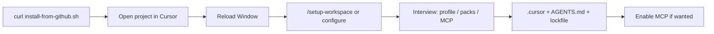

# Cursor install UX

cursorAssistant targets **individual developers**: one GitHub install command, then customized surfaces in each project.

## Recommended journey



### Step 1 — Install package (one command)

```sh
curl -fsSL https://raw.githubusercontent.com/asafelobotomy/cursorassistant/v0.12.0/scripts/install-from-github.sh | bash -s -- /path/to/your-project
```

This downloads the package, registers the **local Cursor plugin** symlink, and runs **configure** (interview + project install).

README badge (links here):

[](https://github.com/asafelobotomy/cursorassistant#install)

### Step 2 — Reload Cursor

**Developer: Reload Window** so `~/.cursor/plugins/local/cursor-assistant` agents, skills, and commands load.

### Step 3 — Use in the project

- `/cursor-assistant:setup-workspace` — re-run or fix setup
- `/inventory`, `/task-triage`, `/cursorLifecycle`
- Agent: **Set up cursorAssistant in this workspace**

### Updates

**Global package** (new release):

```sh
CURSOR_ASSISTANT_VERSION=0.12.0 curl -fsSL https://raw.githubusercontent.com/asafelobotomy/cursorassistant/v0.12.0/scripts/install-from-github.sh | bash -s -- .
```

**Project surfaces** (same package version):

```sh
python3 cursorAssistant.py update --workspace .
```

`--package-root` is optional after the first install.

## What gets installed where

| Layer | Location | Purpose |
| --- | --- | --- |
| Package copy | `~/.local/share/cursorassistant/<version>` | Lifecycle CLI source |
| Local plugin | `~/.cursor/plugins/local/cursor-assistant` → package | Cursor loads agents/skills/commands at user scope |
| Project | Repo `.cursor/`, `AGENTS.md`, lockfile | Your choices; drift detection and `update` |

## Interview (defaults)

| Question | Default |
| --- | --- |
| Profile | `balanced` |
| Packs | none (`lean` profile adds lean pack) |
| MCP extensions | off — **cursorTools** still installed for lifecycle |

## GitHub README buttons

Badges are **links**, not executors. The install badge points to the `curl` one-liner above.

Optional after project install: [MCP install deeplink](https://cursor.com/docs/mcp/install-links) for **cursorTools** (user confirms in Cursor).

## Other paths

| Path | When |
| --- | --- |
| **Git clone + `install-from-github.sh`** | Developing cursorAssistant itself |
| **`cursor-assistant-init.sh`** | Clone already on disk |
| **`configure` / `update` with `--answers`** | CI or automation |
| **Commit `.cursor/` to git** | Team shares one install snapshot |

## Agent surfaces

| Surface | Role |
| --- | --- |
| `commands/setup-workspace.md` | Slash command for project setup |
| `skills/cursorAssistantSetup/SKILL.md` | Agent interview + install |
| `cursorLifecycle` | inspect / update / repair |

## Success criteria

1. README one-liner → working project install without marketplace.
2. One **configure** customizes the current repo.
3. No `--package-root` memorization.
4. **Reload Window** and MCP toggle documented once.

## References

- [INSTALL.md](../INSTALL.md)
- [ARCHITECTURE.md](ARCHITECTURE.md)
