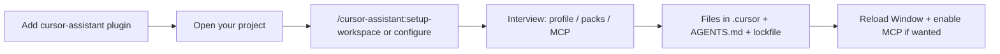

# Cursor install UX (individual developers)

cursorAssistant is aimed at **solo developers**: one marketplace install, then a short **project setup** so agents, skills, rules, and the lockfile match *your* choices (profile, packs, MCP).

## Recommended journey



### Step 1 — One click (Marketplace)

1. Install **cursor-assistant** from [Cursor Marketplace](https://cursor.com/marketplace) (**Add to Cursor**).
2. Cursor downloads the full plugin bundle (agents, skills, rules, commands, MCP template) into your plugin store (`~/.cursor/plugins/…`).
3. Optional: skim **Settings → Rules / Skills**; you can use `/inventory`, `/task-triage`, etc. immediately at user scope.

The plugin alone does **not** write your repo’s `.cursor/` lockfile or selective packs — that is step 2.

### Step 2 — Customize this project

From the **project root** (terminal or Agent):

```sh
python3 cursorAssistant.py configure --workspace .
```

Or in chat: **`/cursor-assistant:setup-workspace`** (see `commands/setup-workspace.md`).

This runs the **interview**, saves `.cursor/cursor-assistant-answers.json`, and installs managed files into the workspace.

Non-interactive (Agent collected answers):

```sh
python3 cursorAssistant.py configure --workspace . \
  --answers .cursor/cursor-assistant-answers.json --yes --json
```

Wrapper when you have a git clone of this repo:

```sh
bash /path/to/cursorassistant/scripts/cursor-assistant-init.sh .
```

### Step 3 — Reload and MCP

1. **Developer: Reload Window** once.
2. If you enabled optional MCP extensions in the interview: **Settings → Features → MCP** → enable **cursorTools** (and others as needed).

### Updates

- **Plugin:** update from Marketplace when a new version ships (user-level bundle).
- **Project:** after pulling a newer cursorAssistant release or changing answers:

  ```sh
  python3 cursorAssistant.py update --workspace .
  ```

  Or ask: **update cursorAssistant** → **cursorLifecycle** / cursorTools MCP.

`--package-root` is **optional**. The CLI resolves it from the lockfile, a parent-directory clone, `CURSOR_ASSISTANT_PACKAGE_ROOT`, or the newest **cursor-assistant** plugin under `~/.cursor/plugins/`.

## What gets installed where

| Layer | Location | Purpose |
| --- | --- | --- |
| Plugin (Marketplace) | `~/.cursor/plugins/…` | Full package source; Cursor loads agents/skills/rules/commands |
| Project (lifecycle) | Repo `.cursor/`, `AGENTS.md`, lockfile | Your customized install; drift detection and `update` |

## Interview (defaults are friendly)

| Question | Default |
| --- | --- |
| Profile | `balanced` |
| Packs | none (`lean` profile adds lean pack) |
| MCP extensions (devDocs, memory) | off — **cursorTools** still installed for lifecycle |

## Alternative paths

| Path | When |
| --- | --- |
| **Clone + init script** | You prefer a git checkout over Marketplace |
| **`setup` / `update` with `--answers`** | CI or scripted reinstall |
| **Enterprise team marketplace** | Org imports the repo; developers still run **configure** per project if they want a lockfile in git |

Teams *may* commit `.cursor/` + lockfile; that is optional, not the primary story.

## Agent and command surfaces

| Surface | Role |
| --- | --- |
| `commands/setup-workspace.md` | Slash command for project setup |
| `skills/cursorAssistantSetup/SKILL.md` | Agent interview + install checklist |
| `cursorLifecycle` | inspect / update / repair after install |

## Success criteria

1. Marketplace → chat works without cloning Python docs.
2. One **configure** (or slash command) customizes the **current repo**.
3. No need to memorize `--package-root`.
4. Docs say **Reload Window** and MCP toggle once.

## References

- [INSTALL.md](../INSTALL.md)
- [PUBLISH.md](PUBLISH.md)
- [ARCHITECTURE.md](ARCHITECTURE.md)
