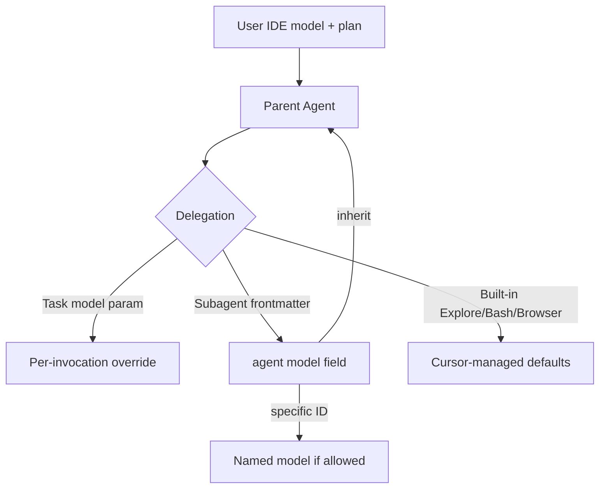

# Model pinning audit (cursorAssistant agents)

Audit date: 2026-06-04. Scope: all core `agents/*.md`, install policy, profiles, cursorEval live runs, and [Cursor subagents docs](https://cursor.com/docs/subagents).

## Executive summary

| Finding | Recommendation |
| --- | --- |
| All 11 roster agents use `model: inherit` | **Keep** — optimal default for a distributable package |
| No per-profile or lockfile model policy | **Do not add** repo-wide model IDs (plans and IDE settings differ) |
| Built-in **Explore** uses a faster model by design | Route wide search to Explore, not a custom `explore` agent |
| `readonly` / `is_background` are set correctly | Keep current split (see matrix below) |
| cursorEval `gpt-4o-mini` | Eval-only; not agent pinning — document in maintainer docs |
| Cursor may ignore frontmatter `model` on some plans | Document IDE fallbacks; avoid hard-pinned premium models in package |

**Verdict:** Current configuration is already near-optimal for a multi-tenant package. Improvements are **documentation + routing**, not pinning `claude-*` / `gpt-*` in agent YAML.

---

## How model selection works (three layers)



| Layer | Controlled by | cursorAssistant |
| --- | --- | --- |
| Parent chat model | User / team / Cursor Auto | Out of scope |
| **Task `model` argument** | Parent agent at invoke time | Documented in [ROUTING_AND_SUBAGENTS.md](ROUTING_AND_SUBAGENTS.md) |
| **Agent YAML `model`** | `.cursor/agents/<name>.md` | **All roster: `inherit`** |
| Built-in subagents | Cursor (Explore = faster model) | Do not shadow `explore` |

Official behavior ([Cursor docs](https://cursor.com/docs/subagents#model-configuration)):

- `inherit` (default) — same model as parent.
- Specific model ID — e.g. `gpt-5.5`, `composer-2`, when allowed.
- Cursor **may override** when: team admin blocks model, Max Mode required, or plan excludes model. Legacy request-based plans without Max Mode may run subagents on Composer regardless of YAML.

---

## Current roster matrix

| Agent | `model` | `readonly` | `is_background` | Work type | Pinning note |
| --- | --- | --- | --- | --- | --- |
| `cursorLifecycle` | inherit | — | — | CLI / MCP mutations | Needs parent reasoning; inherit ✓ |
| `inventory` | inherit | true | — | Read-only maps | inherit ✓; parallel search → **Explore** |
| `review` | inherit | true | true | Long PR/diff read | inherit ✓; background ✓ |
| `researcher` | inherit | true | true | External citations | inherit ✓; background ✓ |
| `debugger` | inherit | true | — | RCA, blocking | inherit ✓; parent needs output |
| `planner` | inherit | true | — | Plans, blocking | inherit ✓ |
| `commit` | inherit | — | — | git / gh | inherit ✓ |
| `deps` | inherit | — | — | Package mutations | inherit ✓ |
| `docs` | inherit | — | — | Doc authoring | inherit ✓ |
| `organise` | inherit | — | — | Moves / imports | inherit ✓ |
| `cleaner` | inherit | — | — | Hygiene | inherit ✓ |

**Not in frontmatter:** `explore` (use built-in Explore), `task-triage` (skill only).

---

## What is *not* model pinning today

| Mechanism | Purpose |
| --- | --- |
| `template/setup/profile-registry.json` | Output style (`balanced` / `lean`) and default **packs** — not models |
| `cursorAssistant-lock.json` | File hashes, packs, MCP — no `model` field |
| `skills/*` `disable-model-invocation` | Stops **skill** auto-load — unrelated to subagent models |
| `tools/cursorEval` `DEFAULT_MODEL` | GitHub Models for **eval runs** only (`gpt-4o-mini`) |

---

## Optimal configuration (recommendations)

### 1. Package defaults — keep `model: inherit` on all roster agents

**Why:**

- Users run different parent models (Auto, Opus, GPT, team defaults).
- Pinning `claude-4.6-opus-*` or `gpt-5.4` in the repo breaks other plans and triggers Cursor fallbacks.
- Forum reports show explicit YAML models sometimes ignored; `inherit` matches parent intent when overrides work.

**Do not** add a `lean` profile that sets cheaper subagent models in YAML — lean pack already reduces **tokens in instructions**, not runtime model.

### 2. Use routing for cost/latency, not YAML pins

| Goal | Prefer |
| --- | --- |
| Cheap parallel codebase grep | Built-in **Explore** (Cursor uses faster model) |
| Deep reasoning on one failure | `debugger` / `planner` with **inherit** |
| Long review without blocking parent | `review` / `researcher` with **inherit** + `is_background: true` ✓ (already) |
| User wants specific subagent model | Parent passes Task `model` at invoke time (ephemeral) |

### 3. IDE settings (consumer responsibility)

Document for users (not in managed files):

- **Settings → Agents → Subagents** — built-in Explore model (e.g. switch from Composer 2 to “Inherit from parent” if desired).
- **Max Mode** — required on some plans for non-Composer subagent models.

### 4. Optional explicit pin (team fork only)

Only if a **team** standardizes on one model ID and verifies it on their plan:

```yaml
model: gpt-5.5   # example — do not ship in upstream cursorAssistant
```

Use for a dedicated “reasoning-agent” role, not the whole roster. Upstream package should stay `inherit`.

### 5. cursorEval / CI

| Check | Status | Action |
| --- | --- | --- |
| Static `model` in allowed frontmatter fields | ✓ `_static.py` | Optional policy: warn if `model` ≠ `inherit` in package sources |
| Live model routing | `evals/models-smoke` + `gpt-4o-mini` | Keep; documents routing under cheap judge |
| Verify runtime subagent model | Not feasible in CI | Manual check in Cursor UI when debugging |

Env: `CURSOR_EVAL_MODEL` overrides eval judge model only.

### 6. `core.mdc` (optional one-liner)

Consider reinforcing: subagent roster defaults to **inherit**; do not set per-agent model IDs unless the team standardizes models in IDE settings.

---

## Anti-patterns

| Anti-pattern | Why |
| --- | --- |
| Pin premium model on all 11 agents | Cost, plan breakage, YAML ignored on some tiers |
| Custom `explore` agent with `model: fast` | Shadows built-in Explore; loses parallel fast search |
| `model: inherit` on `debugger` but parent uses weak model | Inherit propagates weakness — fix parent model, not debugger pin |
| Confusing eval `gpt-4o-mini` with production pinning | Evals test prompts, not Cursor runtime |

---

## Verification

```sh
# Frontmatter snapshot
rg '^model:' agents/*.md

# Policy scan
python3 tools/cursorEval/cursorEval.py policy

# Optional live routing (token required)
bash scripts/eval_models_pr_smoke.sh
```

Manual: invoke `/review` with parent set to your preferred model; confirm subagent matches (Cursor UI / usage panel).

---

## Related docs

- [ROUTING_AND_SUBAGENTS.md](ROUTING_AND_SUBAGENTS.md) — Task `model`, background subagents
- [PERFORMANCE.md](PERFORMANCE.md) — skill auto-invoke (not model)
- [CURSOR_EVAL_AUDIT.md](../audits/CURSOR_EVAL_AUDIT.md) — GitHub Models in evals
