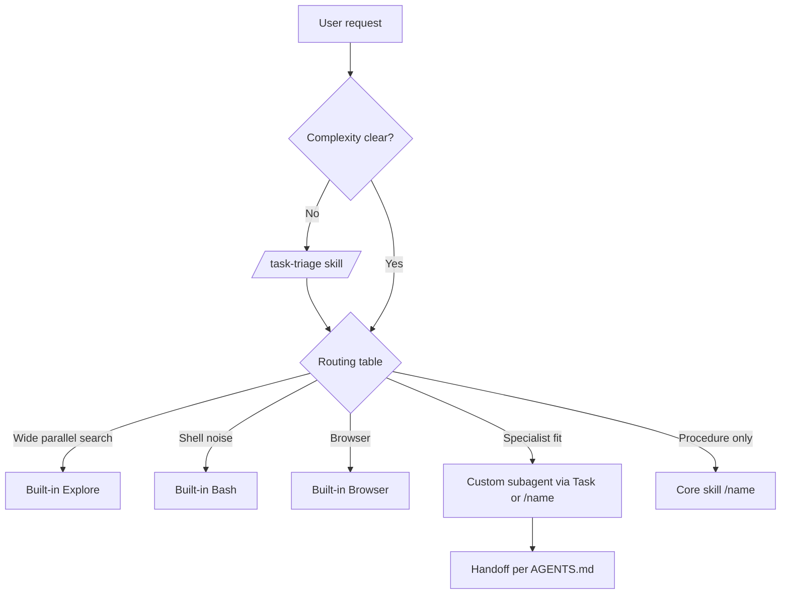

# Routing and subagent invocation (cursorAssistant)

Research-backed design for getting the **right specialist on every task** in Cursor. Complements [../audits/AGENTS_SKILLS_CURSOR_AUDIT.md](../audits/AGENTS_SKILLS_CURSOR_AUDIT.md).

## How Cursor actually routes

Cursor uses **three layers** (see [Subagents | Cursor Docs](https://cursor.com/docs/subagents)):

| Layer | Location | Role |
| --- | --- | --- |
| **1. Subagent `description`** | YAML frontmatter in `.cursor/agents/*.md` | Primary signal for **automatic** Task delegation |
| **2. Project routing doc** | `AGENTS.md` (root) | Parent-agent orchestration: built-ins, roster, handoffs, phrases |
| **3. Always-on rules** | `.cursor/rules/*.mdc` | Reinforce triage, built-in Explore, deprecated MCP |

**Skills** (`/skill-name`) are **not** subagents: they run in the parent context as procedures. Use them when the main Agent should follow steps without a fresh context window.

**Built-in subagents** (Explore, Bash, Browser) ship with Cursor; custom files must **not** shadow `explore`.

### Invocation modes

| Mode | When to use |
| --- | --- |
| **Automatic** | Parent reads `description` + task; delegates via **Task** |
| **`/agent-name`** | User or parent forces a specialist |
| **Task tool** | Explicit `subagent_type` + self-contained `prompt` |
| **Skill `/name`** | Procedural routing (triage, search, CI) without spawning |

Forum note: Task accepts `subagent_type`, `prompt`, `model`, `run_in_background`, `readonly` — rules can steer *when* to call Task, not replace description quality ([Cursor Forum #159562](https://forum.cursor.com/t/subagent-control-via-rules-and-settings/159562)).

## Research takeaways (2025–2026)

1. **Descriptions are job postings** — vague text → over- or under-delegation ([Cursor docs](https://cursor.com/docs/subagents), [subagent-creator skill](https://github.com/tech-leads-club/agent-skills)).
2. **Fewer, sharper agents** — 11 focused roles beat a large roster; parent spends less time choosing ([Medium guide](https://medium.com/@codeandbird/cursor-subagents-complete-guide-5853e8d39176)).
3. **`readonly: true`** for auditors (review, debugger, planner, inventory, researcher) — least privilege.
4. **Parallel only when file ownership is disjoint** — merge conflicts if two agents edit the same paths.
5. **AGENTS.md + SKILL.md** — highest leverage for team-wide conventions ([AI Makers 2.4 guide](https://www.aimakers.co/blog/cursor-2-4-subagents/)).
6. **Triage before spawn** — avoid subagents for Trivial/Simple work (`task-triage` skill).

Phrases like **“Use proactively when…”** in `description` increase auto-delegation for read-only auditors (official Cursor guidance).

## cursorAssistant routing model



### Default: main Agent

If tier is **Trivial** or **Simple** (`task-triage`), the main Agent should **not** spawn a custom subagent.

### Conflict resolution

When two specialists seem to fit, use this tie-breaker (also in `AGENTS.md`):

| Situation | Choose | Not |
| --- | --- | --- |
| “Find anything about X” across repo | Built-in **Explore** | `inventory` |
| Caller map / handoff doc before refactor | `inventory` | Explore |
| Write README / migration in repo | `docs` | `researcher` |
| Upstream API docs / cited external research | `researcher` | `docs` |
| `npm audit` / install package | `deps` | `researcher` |
| Prune `__pycache__`, stale artifacts | `cleaner` | `organise` |
| Move module + fix imports | `organise` | `cleaner` |
| Plan 3+ files before coding | `planner` | main Agent alone |
| pytest traceback, root cause | `debugger` | `review`, `planner` |
| PR / diff review, no implementation | `review` | `debugger` |
| stage / commit / `gh pr create` | `commit` | main Agent |
| `.cursor/` install / lockfile | `cursorLifecycle` | main Agent |
| First project install after bootstrap | `cursorAssistantSetup` skill | bare feature coding |

## Best implementation checklist (cursorAssistant)

| Practice | Status |
| --- | --- |
| No custom `explore` agent | Done (`inventory` + docs) |
| Built-in Explore/Bash/Browser in `AGENTS.md` | Done |
| `readonly` on read-only specialists | Done |
| Negative boundaries in `description` | Enhanced |
| `task-triage` before multi-agent | Done |
| Handoff section per agent | Done |
| Routing table + conflict matrix in `AGENTS.md` | Done |
| Static routing evals (`expected` on tasks) | Strengthened |
| `cursorEval` policy (no VS Code tool names) | Done |
| Pack skills only when lockfile lists pack | Documented in agents |

### Live routing evals

```sh
# PR smoke (models-smoke + cursorAssistantSetup):
bash scripts/eval_models_pr_smoke.sh

# Full routing spot-check (workflow_dispatch or local):
bash scripts/eval_routing_live.sh
```

Requires `GITHUB_MODELS_TOKEN`, `GITHUB_TOKEN`, or `GH_TOKEN`. Results land in `.cursorEval/` (gitignored).

### Background subagents

`review` and `researcher` set `is_background: true` so long read-only work need not block the parent. Do not use background mode for `debugger`, `planner`, or `inventory` — the parent needs their output before the next step.

### Model overrides

Task `model` can override per invocation; roster agents default to `inherit`. See [MODEL_PINNING.md](MODEL_PINNING.md) for the full audit (why the package does not pin `gpt-*` / `claude-*` IDs in agent YAML).

## Handoff rules

- `cursorLifecycle` may delegate to `inventory` for layout maps and `planner` for phased remediation.
- `commit` may delegate to `review` before merge and `debugger` when hooks fail; package-repo sync checklist in `agents/commit.md`.
- `deps` confirms before mutating installed packages; hand off test failures to `debugger`.
- `docs` may delegate to `inventory` for accuracy and `review` for quality passes.
- `debugger` stays read-only; hand off implementation to the main Agent after diagnosis.
- `planner` stays read-only; returns an executable plan with file list and verification steps.
- `review` may delegate to `debugger` when a finding needs reproduction.
- `researcher` stays read-only; hand off implementation to the main Agent or `planner`.
- `organise` may delegate to `inventory` for caller maps and `docs` for migration docs.
- `cleaner` may delegate to `review`, `organise`, `docs`, and `commit` per scope.

### Skill scoping (performance)

| Skill | Auto-invoke | Scope |
| --- | --- | --- |
| `workspaceSearch`, `ciPreflight`, `testing` | yes (default) | `paths` where listed |
| `depSearch`, `task-triage`, `lifecycleAudit`, `surfaceReview`, `cursorAssistantSetup` | **no** (`disable-model-invocation`) | slash `/name`; `paths` where listed |

## Verification

```sh
python3 tools/cursorEval/cursorEval.py policy
python3 tools/cursorEval/cursorEval.py validate
# Optional (needs token):
# python3 tools/cursorEval/cursorEval.py run evals/review --model gpt-4o-mini
```
