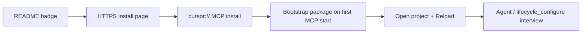

# Cursor install UX

Minimal steps from the README button to the **setup interview**.

## Flow



| Step | User action | What runs |
| --- | --- | --- |
| 1 | Click **Install in Cursor** on [setup page](https://asafelobotomy.github.io/cursorassistant/install/) | `cursor://…/mcp/install` (bootstrap + cursorTools) |
| 2 | Approve MCP in Cursor | `bootstrap-from-github.sh` if package missing |
| 3 | Open project folder | — |
| 4 | Reload Window | Local plugin agents/skills/commands |
| 5 | Chat setup phrase or `lifecycle_configure` | Interview + `configure` → `.cursor/` + lockfile |

## What is *not* in the button path

- No project interview on the web page
- No `curl | bash` required if MCP bootstrap succeeds (optional manual bootstrap in page footer)

## Regenerate setup artifacts

```sh
python3 scripts/generate_install_page.py
```

Updates `install/index.html` and `install/deeplinks.json` for the current [VERSION](../VERSION).

## Terminal-first alternative

```sh
curl -fsSL .../install-from-github.sh | bash -s -- .
```

## References

- [INSTALL.md](../INSTALL.md)
- [../research/DEEPLINK_INSTALL_RESEARCH.md](../research/DEEPLINK_INSTALL_RESEARCH.md)
