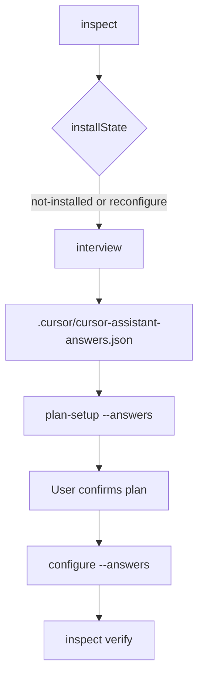
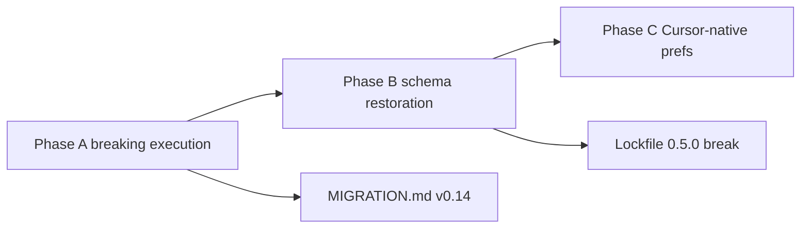

# Interview restoration plan (Phases A–C)

Restore meaningful setup customization and reliable interview execution after the
cursorAssistant Cursor-only pivot. Builds on the deep-dive in chat (2026-06-04):
xanadAssistant shipped 20+ gated questions; cursorAssistant shipped 3 flat
questions plus silent `resolve_answers` bypasses that let agents skip the user entirely.

**Target release:** v0.14.0 (Phase A, **breaking**). v0.15.0 completes schema restoration (Phases B–C).

**Policy:** No backwards compatibility for stale setup paths. Existing workspaces with
pre-v0.14 lockfiles or silent-install habits **must re-run a full interview** via
`configure`. Automation must supply an explicit answers file from a completed interview —
never lockfile replay, never implicit defaults.

**Non-goals:**

- Reintroduce VS Code / Copilot settings interview questions.
- Reintroduce xanad coupling, dual IDE profiles, or `.github/copilot-instructions.md`.
- Pin premium model IDs in upstream agent YAML ([MODEL_PINNING.md](../architecture/MODEL_PINNING.md)).
- New core roster agents (stay at 11); optional dedicated interviewer is Phase C optional.

---

## Breaking change summary (v0.14+)

| Removed / deprecated | Replacement |
| --- | --- |
| `--no-interview` on `configure` | **Removed** — interview is mandatory |
| Silent `resolve_answers` from lockfile on `configure` / `interview` | **Removed** — lockfile never seeds interview answers |
| Auto-loading stale `.cursor/cursor-assistant-answers.json` in `configure` | **Removed** — pass `--answers PATH` explicitly or run `interview` first |
| Non-TTY `configure` without `--answers` | **Errors** with `interview_required` |
| `setup` as a user-facing install command | **Deprecated** — prints error + exit 2; use `configure` |
| `configure --yes` skipping re-interview on `installState: installed` | **Removed** — reconfigure always requires fresh interview |
| `update` / `repair` with missing or stale `setupAnswers` | **Blocked** — `inspect` reports `interviewRequired: true`; run `configure` |
| Plain chat “set up cursorAssistant” without slash skill | **Deprecated UX** — docs mandate `/cursor-assistant:setup-workspace` |
| Lockfile `schemaVersion` 0.4.x without `setup.depth` | **Invalid** after v0.15 — `repair` refuses until `configure` |

Add **MIGRATION.md § v0.14** when Phase A ships.

---

## Canonical setup flow (only supported path)



| Step | Command / action | Notes |
| --- | --- | --- |
| 1 | `inspect --json` | Report `installState`, `interviewRequired` |
| 2 | `interview` (TTY) **or** agent `AskQuestion` → write answers file | No lockfile seeding |
| 3 | `plan-setup --answers .cursor/cursor-assistant-answers.json` | Read-only preview |
| 4 | User confirms | Agent or terminal |
| 5 | `configure --answers .cursor/cursor-assistant-answers.json` | Writes managed surfaces + lockfile |
| 6 | `inspect` | `installState: installed`, `interviewRequired: false` |

**Agent path:** `/cursor-assistant:setup-workspace` or `/cursorAssistantSetup` — same steps; agent must not call deprecated `setup`.

**Automation / CI:** check in a fixture answers file; run `configure --answers tests/fixtures/interview-*.json`. No TTY, no lockfile inference.

---

## Success criteria (end state)

| Criterion | Measure |
| --- | --- |
| User always completes interview before first install | CLI rejects all bypass paths; evals fail on silent setup |
| Reconfigure always re-interviews | No `--yes` refresh; no lockfile replay |
| Power users access advanced customization | `setup.depth` gates extended questions (Phase B) |
| Per-agent knobs for installed agents | Plan-time agent batch → `setupAnswers` + agent tokens (Phase B) |
| Workspace context auto-detected | Silent scanner tokens (Phase B) |
| Cursor-native prefs documented | Post-install User Rules step (Phase C) |
| Stale installs detected | `inspect.interviewRequired` + `update`/`repair` hard stop |

---

## Dependency graph



Phase A is a **breaking** release on its own. Phase B adds another lockfile break (0.5.0).

---

## Phase A — Breaking execution cleanup (no schema expansion yet)

**Goal:** One install contract. Deprecate every path that wrote managed files without a
fresh, explicit interview.

### A0 — Deprecation inventory (implement first)

**Files:** `scripts/lifecycle/cli.py`, `scripts/lifecycle/interview.py`, `scripts/lifecycle/engine.py`, `template/setup/catalog.json`, `mcp/scripts/cursorToolsMcp.py`

| Stale process | Action |
| --- | --- |
| `configure --no-interview` | Remove flag; error if passed (unknown argument) |
| `_load_configure_answers` auto-reads answers file without `--answers` | Remove; only `--answers` or TTY `run_terminal_interview` |
| `resolve_answers(..., lockfile)` in configure/interview load path | Remove lockfile branch for interview resolution; lockfile used only for `update`/`repair` *file* sync, not answer seeding |
| Non-TTY configure without `--answers` | `ValueError` / exit 1: `interview_required` |
| `setup` subcommand for consumers | Deprecate: emit stderr warning + exit 2 with hint to use `configure --answers` |
| `configure --yes` / `-y` | Remove; confirmation is part of interview contract (TTY prompts remain for apply step only) |
| `already-installed` non-TTY early return | Remove; reconfigure requires `--answers` from new interview |
| `lifecycle_setup` MCP tool | Deprecate or alias to `configure` with required `answersPath` |
| `engine.setup()` direct from agents | Skill forbids; only `configure` entry |

**Keep (narrow exceptions):**

- `inspect`, `plan-setup`, `interview`, `configure`, `update`, `repair`, `factory-restore`
- `update` / `repair` / `factory-restore` accept `--answers` to re-materialize after interview
- `factory-restore` still force-writes files but **requires** valid answers file if `interviewRequired`

### A1 — Harden `cursorAssistantSetup` skill

**Files:** `skills/cursorAssistantSetup/SKILL.md`, `commands/setup-workspace.md`, new `skills/cursorAssistantSetup/references/interview-flow.md`

**Mandatory workflow:**

1. `inspect --json` — if `interviewRequired`, proceed; never skip because lockfile exists
2. **AskQuestion** for every key in current `interview.json` (no lockfile inference)
3. Write `.cursor/cursor-assistant-answers.json`
4. `plan-setup --answers …` — show summary; **user confirms**
5. `configure --answers …` — never `setup`
6. `inspect` — confirm `interviewRequired: false`

**Forbidden:**

- `python3 cursorAssistant.py setup …`
- Writing defaults without AskQuestion
- `configure` without `--answers` after agent interview

### A2 — `inspect.interviewRequired`

**Files:** `scripts/lifecycle/engine.py`, `tests/test_engine.py`

Add computed field:

```json
"interviewRequired": true
```

When any of:

- `installState: not-installed`
- answers file missing or older than lockfile `timestamps.updatedAt`
- lockfile `schemaVersion` below package minimum
- `setupAnswers` incomplete for current `interview.json` (+ agent registry in Phase B)

`update` and `repair` return error if `interviewRequired` unless `--answers` provided.

### A3 — Eval guardrails

**Files:** `evals/cursorAssistantSetup/eval.yaml`, `evals/cursorAssistantSetup/tasks/*.yaml`

| Task | Intent |
| --- | --- |
| `positive-interview-flow` | Full inspect → interview → plan → configure path |
| `negative-silent-setup` | Fail if `setup` or `configure` without `--answers` suggested |
| `negative-lockfile-replay` | Fail if agent proposes reading lockfile for profile/packs |
| `positive-reconfigure` | Installed workspace still runs AskQuestion before configure |

Deprecate eval tasks that reward bare `lifecycle_configure` without interview steps.

### A4 — Docs + migration

**Files:** `INSTALL.md`, `README.md`, `docs/guides/CURSOR_INSTALL_UX.md`, `docs/guides/MIGRATION.md`, `CHANGELOG.md`

- Document **only** canonical flow (table above)
- Remove references to `--no-interview`, bare `setup`, `--yes` refresh
- **MIGRATION.md § v0.14:** run `/cursor-assistant:setup-workspace` or `interview` + `configure --answers`

### Phase A verification

```sh
python3 -m unittest discover -s tests -q
python3 tools/cursorEval/cursorEval.py validate
python3 tools/cursorEval/cursorEval.py check skills/cursorAssistantSetup/SKILL.md
bash scripts/sync_managed_surfaces.sh
python3 scripts/check_package_sync.py
```

**Ship:** v0.14.0 (breaking).

---

## Phase B — Progressive disclosure (schema + engine break)

**Goal:** xanad-style depth, Cursor-native. No migration from 0.4.x lockfiles — full re-interview required.

### B1 — `setup.depth` and batch gating

**Files:** `template/setup/interview.json`, `scripts/lifecycle/interview.py`

| `setup.depth` | Batches |
| --- | --- |
| `simple` | `setup`, `simple` |
| `advanced` | + `advanced` |
| `full` | + `full` |

First question in every interview. No default depth inferred from old lockfiles.

### B2 — Tier 2 personalization (batch `advanced`)

| Key | Default | Token |
| --- | --- | --- |
| `response.style` | balanced | `{{RESPONSE_STYLE}}` |
| `autonomy.level` | ask-first | `{{AUTONOMY_LEVEL}}` |
| `agent.persona` | professional | `{{AGENT_PERSONA}}` |

New `template/rules/preferences.mdc` layer (not `core.mdc` bloat). Precedence: pack > interview > profile.

### B3 — `testing.philosophy` (batch `full`)

Default `always`; interacts with optional `tdd` pack.

### B4 — Lean pack verbosity (conditional)

`lean.reasoning.mode`: compressed / silent when lean pack selected.

### B5 — Workspace scanner (silent tokens)

Port xanad `_workspace_scan.py` → `scripts/lifecycle/workspace_scan.py`.

Tokens: `PRIMARY_LANGUAGE`, `PACKAGE_MANAGER`, `TEST_COMMAND` — scanner runs every materialize; no lockfile cache of stale scan results across schema versions.

### B6 — Agent customization registry (plan-time batch)

**New:** `template/setup/agent-registry.json`, `scripts/lifecycle/agent_customization.py`

Agents: commit, docs, review, planner (not explore — built-in Explore replaces xanad explore).

Answers → `setupAnswers`; required for `interviewRequired: false` when those agents are installed.

### B7 — Skill + CLI sync

Extended `references/interview-flow.md`: depth → base → plan-time agent batch → configure.

`interview` command runs all applicable batches in one TTY session.

### B8 — Lockfile `schemaVersion` 0.5.0 (breaking)

- All 0.4.x lockfiles → `inspect.interviewRequired: true`
- No “empty `setupAnswers` → defaults on `update`” — **re-interview only**
- `inspect` reports `interviewDepth`, `setupAnswers` key count

**Ship:** v0.15.0 (breaking vs 0.14 if schema incomplete).

---

## Phase C — Cursor-native customization

**Status:** Implemented (2026-06-04).

| Item | Deliverable |
| --- | --- |
| C1 | `scripts/lifecycle/user_rules.py`, `skills/cursorAssistantSetup/references/user-rules-step.md`, `tests/test_user_rules.py`, `evals/.../positive-user-rules-offer.yaml` |
| C2 | `agents/cursorLifecycle.md` reconfigure handoff table; `INSTALL.md` + `MIGRATION.md` § v0.15 User Rules |
| C3 | `install/index.template.html` → generated `install/index.html` (step 4: slash command, depth, no silent install) |
| C4 | `docs/architecture/MODEL_PINNING.md` appendix (team forks only; upstream AskQuestion + CLI) |

### C1 — Post-install User Rules (optional step)

After successful `configure`, offer User Rules for `autonomy.level`, `response.style`, `agent.persona` via `cursor_dialog` or paste. Not stored in lockfile.

### C2 — `cursorLifecycle` handoff

| User intent | Route |
| --- | --- |
| First install | `interview` → `configure --answers` |
| Change packs | Full re-interview (depth `simple` minimum) |
| Change personalization | Re-interview depth `advanced` or `full` |
| Sync stale files only | `update --answers` **only if** `interviewRequired: false` |

Remove any doc that says `update` alone fixes preference drift.

### C3 — Install page

Step 4: slash command + interview depth; explicit “no silent install.”

### C4 — Setup interviewer subagent (optional team fork only)

Document in `MODEL_PINNING.md` appendix — not upstream. Upstream uses AskQuestion + canonical CLI.

**Ship:** v0.15.0 (with B) or v0.15.1.

---

## Removed processes reference (do not reintroduce)

| Process | Why it was stale |
| --- | --- |
| Lockfile-as-answers | Let agents skip user; froze choices silently |
| `--no-interview` | CI escape hatch that became default in Agent shell |
| Auto-load answers file | Stale preferences applied without user awareness |
| `setup` without interview | Split brain vs `configure` |
| `--yes` on installed workspace | Refresh without re-consent |
| 3-question flat schema as “full” install | False completeness vs xanad/CIT expectations |
| `lifecycle_setup` without `answersPath` | MCP automation bypass |

---

## Testing matrix

| Layer | Phase A | Phase B | Phase C |
| --- | --- | --- | --- |
| Unit | deprecated flags removed; `interview_required` errors; `setup` exit 2 | depth gating; scanner; agent batch | rule mapping |
| Eval | anti-silent-setup; anti-lockfile-replay | advanced fixture | User Rules offer |
| Dogfood | canonical flow only | full + advanced interview fixtures | manual |
| CI | tests enforce no `--no-interview` in scripts/docs | lockfile 0.5.0 fixtures | migration doc link |

**Fixtures:** `tests/fixtures/interview-simple.json`, `interview-advanced.json`, `interview-full.json` — **required** for any automated configure in CI.

---

## Risks (revised)

| Risk | Mitigation |
| --- | --- |
| CI scripts used bare `setup` | Grep CI/docs; replace with `configure --answers` fixtures |
| Users on 0.4 lockfile | `inspect.interviewRequired` + MIGRATION.md |
| Agent ignores skill | Evals + deprecated `setup` exit 2 |
| Longer install friction | `setup.depth` progressive disclosure (Phase B) |
| Package repo dogfood | Re-run interview in `dogfood-full.sh` with committed fixture |

---

## Work breakdown

| # | Task | Phase |
| --- | --- | --- |
| 1 | **A0** Remove deprecated CLI/MCP paths | A |
| 2 | **A2** `interviewRequired` in inspect + update/repair gates | A |
| 3 | **A1** Skill + setup-workspace + interview-flow reference | A |
| 4 | **A3** Evals (incl. negative-lockfile-replay) | A |
| 5 | **A4** MIGRATION.md v0.14 + doc purge | A |
| 6 | **B1–B8** Schema + engine break | B |
| 7 | **C1–C4** User Rules + lifecycle handoff | C |

**Order:** A0 → A2 → A1 → A3 → A4 → ship **v0.14.0** → B → C → ship **v0.15.0**.

---

## Verification (each phase)

```sh
python3 tools/cursorEval/cursorEval.py validate
python3 tools/cursorEval/cursorEval.py check skills/cursorAssistantSetup/SKILL.md
python3 -m unittest discover -s tests -q
rg -n "no-interview|--yes|cursorAssistant.py setup" --glob '!docs/project/INTERVIEW_RESTORATION_PLAN.md'  # must be zero outside migration/history
bash scripts/sync_managed_surfaces.sh
python3 scripts/check_package_sync.py
python3 cursorAssistant.py inspect --workspace . --json
```

---

## Related docs

- [MIGRATION.md](../guides/MIGRATION.md) — add § v0.14 on Phase A ship
- [PERFORMANCE_PHASED_PLAN.md](PERFORMANCE_PHASED_PLAN.md)
- [MODEL_PINNING.md](../architecture/MODEL_PINNING.md)
- [ARCHITECTURE.md](../architecture/ARCHITECTURE.md)
- xanad reference (read-only): `interview-expansion-plan.md`, `_interview.py`
