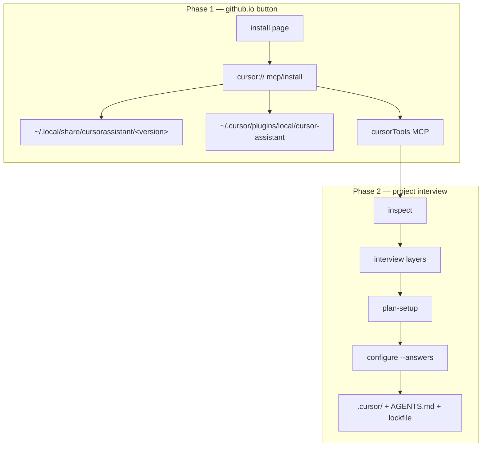

# Token expansion and pack interview plan (Phases D1–D5)

Refine the **symlink + MCP bootstrap** install path (github.io → `cursor://` →
`mcp-launch.sh` → plugin symlink) and extend customization through **tokens** and
**pack-gated interview questions**. Builds on [INTERVIEW_RESTORATION_PLAN.md](INTERVIEW_RESTORATION_PLAN.md)
(Phases A–C, shipped **v0.15.0**).

**Status:** **Shipped** — D1–D5 complete in **v0.16.0 → v0.17.2** (2026-06-05). Refine in-doc only for follow-on gaps (appendix P1+).

## Product focus

**Primary audience:** solo developers doing **vibe coding** with LLM agents — one person,
many projects/workspaces, switching often, optimizing for flow with Cursor Agent rather
than traditional team process.

| Principle | Implication for this plan |
| --- | --- |
| **One human, many repos** | Favor **user-scoped bootstrap** (package + plugin + cursorTools MCP once) and **per-project configure** (short interview when opening a new folder). |
| **Agent-first workflow** | Interview + tokens tune **delegation, subagents, skills, MCP** — not IDE theme or corporate policy. |
| **Low ceremony, high control** | `setup.depth: simple` must stay fast; packs and advanced/full are opt-in depth, not gatekeeping. |
| **Personal prefs follow the dev** | Cursor **User Rules** (Phase C) matter more than committed team prefs; project `preferences.mdc` is repo-specific override when needed. |
| **Teams allowed, not optimized** | Lockfile, committed `.cursor/`, and answers fixtures remain valid for teams/CI; do not design primary UX around org marketplaces, SCIM, or shared governance. |
| **Transparent config** | Solo devs **commit** interview answers and managed `.cursor/` surfaces; no hidden lockfile-only state. Exclude secrets and PII from answers files. |

**Not the main story:** enterprise rollout, mandatory org plugins, multi-tenant admin, or
“every engineer identical config.” Those paths should keep working without driving D1–D5
priorities.

---

## Decided product UX (2026-06-05)

| # | Decision | Design implication |
| --- | --- | --- |
| **1** | **Copy from existing project** | Preflight interview question; user may supply a **GitHub repo URL**; engine fetches that repo’s committed `.cursor/cursor-assistant-answers.json` as a **starting template** (user confirms before apply). Not lockfile replay. |
| **2** | **User-level defaults** | `~/.cursor/cursor-assistant-defaults.json` pre-fills new interviews; **per-project** `.cursor/cursor-assistant-answers.json` overrides on save/configure. |
| **3** | **Commit answers (solo)** | **Do commit** `.cursor/cursor-assistant-answers.json` for transparency and copy-from-source; document exclusions (secrets, tokens, PII). |
| **4** | **Returning users on install page** | When bootstrap is already done, page emphasizes **open project + setup phrase** only (skip re-explaining MCP clone). |

### Round 2 — implementation decisions (2026-06-05)

| # | Topic | Decision |
| --- | --- | --- |
| **5** | Save defaults UX | **Explicit** “Save as my defaults?” after successful `configure` — not auto-update every time. Optional “always update defaults” later (advanced). |
| **6** | Copy-from private repos | **Public:** raw GitHub URL. **Private:** `gh api` / `gh raw` when `gh auth status` succeeds; clear error + fallback to defaults-only if unavailable. |
| **7** | Copy-from branch/tag | **Default branch only** in v1; reject `/tree/` URLs with helpful message; optional `setup.copyFrom.ref` deferred. |
| **8** | Pack interview files | **`packs/<id>/interview.json`** + `interviewPath` in `pack-registry.json`. |
| **9** | Token collisions | **Namespaced** tokens (`pack:tdd:scope-discipline`, etc.); shared `pack:*` only when documented non-overlapping. |
| **10** | Partial reconfigure | **D3:** if only `packs.selected` changes, re-ask pack layer + `plan-setup`; full re-interview for depth/profile changes. |
| **11** | Lockfile pack answers | Nested **`packAnswers: { "<packId>": { ... } }`** in lockfile (schema **0.6.0** when D3 ships); core keys stay in `setupAnswers`. |
| **12** | MCP before configure | **Yes** on install-page path; CLI fallback if MCP not enabled. |
| **13** | plan-setup token preview | **Grouped summary** by family; optional expand / `--verbose` for full token text. |
| **14** | D4 agent token priority | **debugger** → **ciPreflight** → **deps** → **inventory** (after existing agent batch). |
| **15** | Release split | **v0.16.0** = D1; **v0.16.1** = D2 pack tokens; **v0.17.0** = D3 pack interview + `packAnswers`. |
| **16** | Copy-from schema | **`setup.copyFrom.*` optional keys** on interview **0.5.0** for D1; lockfile **0.6.0** only with D3/`packAnswers`. |

### Round 3 — remaining open items (2026-06-05)

| # | Topic | Decision |
| --- | --- | --- |
| **17** | Always update defaults | **D1:** explicit “Save as my defaults?” only. **v0.17.x:** optional `setup.defaults.autoSave` boolean in **advanced** interview (stored in `~/.cursor/cursor-assistant-defaults.json`, not lockfile). No separate Cursor setting. |
| **18** | `setup.copyFrom.ref` | **D1:** default branch only. Reserve optional `setup.copyFrom.ref` in schema (null/unset). **v0.17+** if needed: branch or tag via `gh api …?ref=` / raw with ref. |
| **19** | Legacy `pack:*` migration | **v0.16.1 (D2):** rename to namespaced keys in sources + **one-release alias map** in `pack_tokens()` loader. **v0.17.0 (D3):** remove aliases. Document in MIGRATION.md § v0.16.1. `lean.reasoning.mode` → `pack:reasoning-mode` stays in `preference_tokens.py` (core, not pack alias). |

---

**Policy (unchanged from v0.14+):**

- Mandatory interview before first `configure`; explicit `--answers` for automation.
- No lockfile replay, no silent install, deprecated `setup` stays removed.
- Keep **11** core subagents; niche behavior via packs and tokens, not roster growth.

**Non-goals:**

- Marketplace-only or github.io-only distribution (see native-distribution research in chat 2026-06).
- Dedicated `setupInterviewer` subagent upstream — use **cursorAssistantSetup** skill + **cursorLifecycle** + MCP interview API.
- Tokenizing static routing prose in `AGENTS.md` for decoration only.

---

## Pre-D1 blockers (v0.15 → v0.16.0)

Resolve before or as part of the **v0.16.0** release branch — do not start net-new D1 features on a red baseline.

| Blocker | Action | Owner phase |
| --- | --- | --- |
| CI failing `cursorEval check` on `cursorAssistantSetup` | Add `## When not to use` to [skills/cursorAssistantSetup/SKILL.md](../../skills/cursorAssistantSetup/SKILL.md); sync `.cursor/` | D1 |
| `install-from-github.sh` calls bare `configure` | Require prior `interview` or `--answers` fixture; document in [INSTALL.md](../../INSTALL.md) | D1 |
| `packs/*/tokens.json` not loaded in engine | Track as **D2**; document in release notes if v0.16.0 ships before 0.16.1 | D2 |

---

## Goals

| Goal | Measure |
| --- | --- |
| Robust install → interview → configure flow | Solo dev: bootstrap once, then repeat project setup without confusion; evals pass |
| Minimal user intervention | Second project setup in &lt;2 min at `simple` depth; batched AskQuestion; silent workspace scan |
| Maximum user configuration | Depth tiers + packs when a **side project** needs different agent behavior than the last repo |
| Tokens across managed content | Agents, skills, rules, pack skills — knobs that change how **agents** work in this workspace |
| Packs offload niche customization | Vibe variants (lean / tdd / secure) without bloating core interview for every new folder |
| Multi-workspace ergonomics | Clear mental model: global tooling vs per-repo answers; reconfigure without full re-bootstrap |

---

## Install model (keep current route)



| Layer | Location | When |
| --- | --- | --- |
| Package + CLI | `~/.local/share/cursorassistant/current` | MCP bootstrap |
| Plugin (commands, global agents/skills) | `~/.cursor/plugins/local/cursor-assistant` | `mcp-launch.sh` symlink |
| User MCP | `~/.cursor/mcp.json` (typical) | MCP deeplink approve |
| Project managed surfaces | `.cursor/`, `AGENTS.md`, lockfile | After interview + `configure` |

**Do not change** the primary CTA on [install/index.template.html](../../install/index.template.html) away from combined MCP bootstrap unless a regression forces it.

**Solo-dev fit:** Phase 1 is intentionally **once per machine** (or once per Cursor profile).
Phase 2 repeats per workspace — the install page copy should say “already bootstrapped?
Open your next project and run setup only.”

### Install page — returning users *(decided)*

When the user has already completed MCP bootstrap:

- Promote **secondary path**: “Already installed?” → copy setup phrase / link to `INSTALL.md` project-only steps.
- Hide or de-emphasize primary **Install in Cursor** when local progress indicates `mcp` checked (existing `localStorage` in [install/index.template.html](../../install/index.template.html)); still allow re-run for repair.
- Copy block: open project → Reload Window → `/cursor-assistant:setup-workspace`.
- No claim that the button re-runs project configure.

---

## Interview layering

Ask in order; later layers depend on earlier answers.

| Layer | `setup.depth` / gate | Questions (current + planned) |
| --- | --- | --- |
| **Preflight** | Before `setup.depth` | `setup.copyFrom.enabled`, `setup.copyFrom.repo` *(planned D1)* |
| **Setup** | After preflight | `setup.depth` |
| **Simple** | all depths | `profile.selected`, `packs.selected`, `mcp.enabled`, agent batch (4 keys) |
| **Pack** | pack ∈ `packs.selected` | Per-pack questions from `packs/<id>/interview.json` *(planned D3)* |
| **Advanced** | advanced, full | `response.style`, `autonomy.level`, `agent.persona` |
| **Full** | full only | `testing.philosophy` |
| **Conditional** | predicates | `lean.reasoning.mode` when lean profile or lean pack *(existing)* |

**UX rules (solo-first):**

- Pack questions run **only after** `packs.selected` is known; skip deselected packs on reconfigure.
- Prefer **one AskQuestion batch per layer** (not one message per key) in the setup skill.
- **Do not** infer answers from the **current workspace lockfile** on cold configure.
- **plan-setup** shows profile, packs, MCP, depth, copy-from source (if any), `wouldWrite`, and a **grouped token summary** *(optional full text / `--verbose`)*.
- **`simple` default** — assume most new workspaces want balanced profile, no packs, fast path.
- **Prefill merge order *(decided)*:**
  1. Load **user defaults** into draft answers (baseline).
  2. If copy-from enabled and fetch succeeds, **merge imported keys over defaults** (template wins on key collision).
  3. Ask only **pending** questions for active depth/packs/agent batch.
  4. On **save/configure**, write flat project answers file; **strip** `setup.copyFrom.*` keys (provenance shown in `plan-setup` only, not committed).
- **Copy-from repo** — explicit user opt-in + URL; fetch remote answers file; validate schema; show diff/summary; user confirms before merge into working answers.
- **Advanced/full** — suggest User Rules after configure for IDE-wide persona; project `preferences.mdc` remains committed and transparent.

### Preflight: copy from existing project

First questions in a new workspace interview (before `setup.depth`):

| Key | Type | Prompt (draft) |
| --- | --- | --- |
| `setup.copyFrom.enabled` | boolean | Copy setup answers from an existing project? |
| `setup.copyFrom.repo` | string (URL) | GitHub repository URL (`owner/repo` or https://…) — answers on **default branch** in D1 |
| `setup.copyFrom.ref` | string (optional) | Reserved for v0.17+; branch or tag. Unset in D1. |

**When `enabled: true`:**

1. Resolve URL → `owner/repo` (https://github.com/… or `git@github.com:…`).
2. Fetch `.cursor/cursor-assistant-answers.json` from **default branch**:
   - **Public:** `raw.githubusercontent.com/<owner>/<repo>/HEAD/.cursor/cursor-assistant-answers.json`
   - **Private:** `gh api repos/<owner>/<repo>/contents/.cursor/cursor-assistant-answers.json` (requires `gh auth login`)
3. Validate against current `interview.json` schema (drop unknown keys; flag missing required keys for active depth).
4. Merge into draft answers **before** remaining questions; user sees what was imported in `plan-setup`.
5. **Never** auto-configure without confirm — same contract as manual interview.

**Import fallbacks *(D1)*:**

| Priority | Source |
| --- | --- |
| 1 | `.cursor/cursor-assistant-answers.json` on default branch |
| 2 | Flatten `setupAnswers` + `packAnswers` from `.cursor/cursorAssistant-lock.json` if answers file missing |
| 3 | Fail with clear error; continue interview with defaults-only prefill |

Imported pack-prefixed keys remain in the **flat** project answers file until **D3**, when `configure` splits them into lockfile `packAnswers` (see below).

**Security / hygiene:**

- **No PAT in interview** — private access only via existing `gh` session.
- Reject answers files containing probable secrets (reuse secure pack heuristics or a denylist of key names).
- Document: do not commit API keys into `cursor-assistant-answers.json`; use env and User Rules for secrets.
- Reject repo URLs with branch/path suffixes in v1 (`/tree/`, `/blob/`) — default branch only.

### User-level defaults

| File | Scope | Updated when |
| --- | --- | --- |
| `~/.cursor/cursor-assistant-defaults.json` | User (all projects) | Only when user confirms **“Save as my defaults?”** after `configure` |
| `.cursor/cursor-assistant-answers.json` | Project | Every configure; **committed to git** (solo default) |

Per-project answers **override** user defaults for any key present. Missing keys fall back to defaults during interview prefill.

### Transparency (commit policy)

**Commit** in solo vibe-coding repos:

- `.cursor/cursor-assistant-answers.json`
- `.cursor/cursorAssistant-lock.json`
- Managed `.cursor/agents`, `.cursor/skills`, `.cursor/rules`, `AGENTS.md` (as today)

**Do not commit:** secrets, tokens, credentials, personal email/chat IDs, or other PII in answers or User Rules. Add `SECURITY.md` / setup skill callout.

Enables **copy-from** flow: another repo’s answers file is the portable “profile export.”

---

## Token architecture

### Families

| Family | Source | Example keys | Render targets |
| --- | --- | --- | --- |
| Workspace | `workspace_scan.py` (silent) | `TEST_COMMAND`, `PRIMARY_LANGUAGE`, `PACKAGE_MANAGER` | `testing`, `ciPreflight`, `debugger` |
| Preferences | Core interview (advanced/full) | `RESPONSE_STYLE`, `AUTONOMY_LEVEL`, `AGENT_PERSONA`, `TESTING_PHILOSOPHY` | `preferences.mdc`, optional User Rules |
| Agent | `agent-registry.json` + answers | `agent:commit:message-style`, … | Core agents with `{{agent:*}}` sections |
| Pack | `packs/<id>/tokens.json` + pack interview | `pack:tdd:scope-discipline`, … *(namespaced)* | Pack skills, shared agents (`review`, `commit`, `planner`) |

### Merge order *(decided)*

```
default tokens → workspace scan → preference tokens → agent tokens → pack tokens (per selected pack, namespaced keys)
```

**Collision policy:** **Namespaced pack tokens** (`pack:<packId>:<name>`). Legacy shared `pack:*` keys in existing `tokens.json` migrate to namespaced form in D2; document non-overlap only if a shared key is intentionally retained.

### Where to use tokens (logical targets)

| Surface | Use tokens when… | Avoid when… |
| --- | --- | --- |
| **Agents** | User-chosen behavior knob | Static role description |
| **Skills** | Command, path, or workflow variant | Evergreen procedure text |
| **Rules** | Interview-driven prefs (project) | `core.mdc` lifecycle routing |
| **Pack skills** | Pack-specific discipline | Duplicating core skill entirely |
| **User Rules** | IDE-wide tone/autonomy (solo multi-project) | Duplicating `preferences.mdc` without user consent |

### Known gap (v0.15.0)

`packs/*/tokens.json` exists and is documented in pack READMEs, but **`engine._inspect_tokens()` does not load them yet**. Only `lean.reasoning.mode` from the core interview maps to `pack:reasoning-mode` via `preference_tokens.py`. **D2 must wire pack token loading.**

---

## Pack interview (planned)

### Schema sketch

Per pack: **`packs/<id>/interview.json`** (pointer in `pack-registry.json` — see registry extension below).

```json
{
  "schemaVersion": "0.1.0",
  "questions": [
    {
      "id": "secure.review.default",
      "prompt": "Default security review reporting?",
      "type": "choice",
      "batch": "pack",
      "options": ["owasp-focused", "critical-high-only"],
      "default": "owasp-focused",
      "token": "pack:secure:review-depth",
      "render": {
        "owasp-focused": "…",
        "critical-high-only": "…"
      }
    }
  ]
}
```

### Engine hooks

- `interview.active_questions()` — merge pack questions when `pack_id ∈ packs.selected`.
- `interview.answers_complete()` — require active pack keys.
- `plan-setup` — list pending pack questions per selected pack.
- Fixtures: `tests/fixtures/interview-balanced-lean.json`, `interview-full-tdd-secure.json`, etc.

### Pack registry extension *(decided)*

Extend [template/setup/pack-registry.json](../../template/setup/pack-registry.json):

```json
{
  "id": "tdd",
  "interviewPath": "packs/tdd/interview.json",
  "tokensPath": "packs/tdd/tokens.json"
}
```

### Lockfile `packAnswers` *(decided — D3 / schema 0.6.0)*

Split interview answers in the lockfile for partial reconfigure and transparency:

```json
{
  "schemaVersion": "0.6.0",
  "setupAnswers": {
    "setup.depth": "full",
    "response.style": "balanced",
    "agent.commit.messageStyle": "…"
  },
  "packAnswers": {
    "secure": { "secure.review.default": "owasp-focused" },
    "tdd": { "tdd.cycle.strictness": "strict" }
  }
}
```

| Map | Contents |
| --- | --- |
| `setupAnswers` | Core interview + agent batch + prefs (no `packs.selected` duplication beyond top-level `selectedPacks`) |
| `packAnswers` | Keys from `packs/<id>/interview.json` only, grouped by pack id |

**Project answers file** (`.cursor/cursor-assistant-answers.json`) remains a **flat** JSON map for copy-from portability.

| Phase | Lockfile on `configure` |
| --- | --- |
| **D1 (v0.16.0)** | `setupAnswers` only (schema 0.5.x); flat file may include pack-prefixed keys |
| **D3 (v0.17.0)** | Split flat file → `setupAnswers` + **`packAnswers`**; schema **0.6.0** |

**Partial reconfigure (D3):** drop deselected pack keys from `packAnswers`; re-run pack interview for newly selected packs only.

---

## MCP interview API (planned D1)

Thin wrappers over `interview.py` for Agent/skill use (no TTY required):

| Tool | Purpose |
| --- | --- |
| `lifecycle_interview_questions` | Partial answers → `{ active, pending, complete, schemaVersion, questions[] }` — each question includes `id`, `prompt`, `type`, `options`, `batch` for AskQuestion |
| `lifecycle_interview_import` | `repo` URL (+ optional `ref` later) → fetch, validate, return `{ merged, droppedKeys, warnings }` — does not write until save |
| `lifecycle_interview_save` | Validate `answers_complete`, strip `setup.copyFrom.*`, write `.cursor/cursor-assistant-answers.json` |
| `lifecycle_defaults_load` | Read `~/.cursor/cursor-assistant-defaults.json` if present |
| `lifecycle_defaults_save` | Write user defaults after explicit user confirm (post-configure) |

**Flow:** `lifecycle_inspect` → `lifecycle_defaults_load` → preflight AskQuestion → `lifecycle_interview_import` (optional) → questions loop → `lifecycle_interview_save` → `lifecycle_plan_setup` → confirm → `lifecycle_configure`.

Optional CLI parity: `interview --questions-json [--answers PATH]` for tests and scripts.

---

## Install / interview flow refinements

| Step | User action | Refinement |
| --- | --- | --- |
| 1 | Install in Cursor (github.io) | First visit only; returning users see project-setup CTA |
| 2 | Open project | Unchanged |
| 3 | Reload Window | Unchanged |
| 4 | `/cursor-assistant:setup-workspace` | Preflight copy-from + defaults prefill; MCP interview API; batched AskQuestion |
| 5 | Confirm plan | **Grouped** token summary (+ optional full text); copy-from repo + defaults applied |
| 6 | configure | **D1:** flat answers file + lockfile `setupAnswers` only. **D3:** lockfile also gains `packAnswers` + schema 0.6.0. Commit answers with repo. |
| 7 | Optional User Rules | advanced/full only (Phase C) |
| 8 | Save defaults | **Explicit prompt:** “Save as my defaults?” → `~/.cursor/cursor-assistant-defaults.json` |

**Bundled fixes:**

- [x] `install-from-github.sh` — require `interview` or `--answers` (v0.15 breaking gap).
- [x] `cursorAssistantSetup` SKILL — add `## When not to use` (CI `cursorEval check`).
- [x] Install page — returning-user UI + “verify plugin symlink” checklist.
- [x] `scripts/lifecycle/answers_import.py` — public raw URL + private via `gh`; default branch only.
- [x] User defaults read on prefill; write only on explicit post-configure confirm.
- [x] `plan-setup` grouped token summary (+ `--verbose` full text).
- [x] `SECURITY.md` + setup skill — answers denylist; warn before commit.
- [x] D1 evals: `positive-copy-from-prefill.yaml`, negative secret-in-answers import.
- [x] D5: install page fixture links; [PREFERENCES_LAYERS.md](../guides/PREFERENCES_LAYERS.md); ROADMAP § v0.16–0.17.

---

## Phased work breakdown

| Phase | Focus | Ship target |
| --- | --- | --- |
| **D1 — Robustness** | MCP interview tools; preflight copy-from (`gh` + public); user defaults prefill + explicit save; returning-user install page; skill CI; `install-from-github.sh` | **v0.16.0** |
| **D2 — Pack tokens** | Load `tokens.json`; **namespaced** keys; **one-release alias map** for legacy `pack:*`; migrate placeholders | **v0.16.1** |
| **D3 — Pack interview** | `packs/<id>/interview.json`; **`packAnswers`** lockfile 0.6.0; partial reconfigure; **remove pack token aliases** | **v0.17.0** |
| **D4 — Core token expansion** | **debugger** → **ciPreflight** → **deps** → **inventory** tokens; optional **`setup.defaults.autoSave`** (advanced) | **v0.17.x** |
| **D5 — Docs + evals** | Install page fixtures; pack-gated evals; MIGRATION § v0.16–0.17; [PREFERENCES_LAYERS.md](../guides/PREFERENCES_LAYERS.md) | **v0.17.2** |

**Order:** D1 → D2 → D3 → D4 → D5.

---

## Testing matrix

| Layer | D1 | D2 | D3 |
| --- | --- | --- | --- |
| Unit | MCP interview tools; `answers_complete` with partial; import merge order; strip `setup.copyFrom.*` on save | `pack_tokens()` merge; render in materialize; alias map | pack gating; conditional pack questions; flat → `packAnswers` split |
| Integration | configure with MCP-saved answers; copy-from public + mocked `gh`; defaults prefill override | lean+tdd both selected collision case | fixture per pack combo |
| Eval | positive-interview-flow + copy-from prefill; negative secret in import | `positive-pack-tokens` (cursorLifecycle) | pack selected → pack question in flow; `positive-d4-agent-batch` |
| Dogfood | full interview via skill path; committed `cursor-assistant-answers.json` in package repo | pack tokens visible in `.cursor/agents/review.md` | secure pack strictness question |

```sh
python3 -m unittest discover -s tests -q
python3 tools/cursorEval/cursorEval.py validate
python3 tools/cursorEval/cursorEval.py check skills/cursorAssistantSetup/SKILL.md
bash scripts/sync_managed_surfaces.sh
python3 scripts/check_package_sync.py
```

---

## Risks

| Risk | Mitigation |
| --- | --- |
| Interview too long with 3 packs + full depth | Pack questions only for selected packs; keep pack question count small (1–3 each) |
| Token collisions (lean + tdd + secure) | Namespaced tokens or precedence table before D2 |
| Reconfigure churn | Pack-only changes → pack interview + `packAnswers` merge (D3); depth/profile → full re-interview |
| Empty `{{pack:*}}` in workspace | D2 wiring + test that materialized files contain no raw `{{` |
| Plugin vs project drift | Lockfile still tracks project hashes; plugin is bootstrap-only |
| Solo dev skips interview on project 2+ | Skill + install page stress **per-folder** setup; `inspect.interviewRequired` on each new clone |
| Copy-from fetch fails (no `gh`, private repo, no answers file) | Clear error; fall back to defaults-only prefill; continue interview |
| Lockfile 0.5 → 0.6 migration | `packAnswers` empty until reconfigure; `inspect` may prompt pack re-interview |
| Secrets in committed answers | Validate on import/save; document in SECURITY.md; skill warns before commit |
| Over-teamifying | Primary docs stay solo-first; team CI paths documented as secondary in MIGRATION.md |

---

## Open questions

None — plan ready for D1 implementation. Revisit **`setup.copyFrom.ref`** implementation if users request non-default-branch copy-from before v0.17.

---

## Appendix — Gaps & expansions

Tracked improvements beyond the core D1–D5 table. **P0** items above are folded into the main plan; this appendix holds **P1+** and longer-horizon ideas.

### Gaps (address in plan phases)

| Gap | Recommendation | Target |
| --- | --- | --- |
| Copy-from **local path** only | `setup.copyFrom.localPath` or sibling-project picker | D1.1 / v0.16.x |
| **`inspect` setup hints** | `defaultsApplied`, `copyFromPending`, `pendingLayers`, bootstrap vs `packageVersion` | D1.1 |
| **Package upgrade + new interview keys** | `answers_complete` failure → `interviewRequired` + reason `schema-expanded`; document in MIGRATION | D1 + MIGRATION § v0.16 |
| **Agent batch skip** when copy-from supplies complete keys at depth | Skip redundant AskQuestion if `answers_complete` already true for layer | D1 UX polish |
| **`plan-setup` diff** | Show added/changed keys vs defaults and import source | D1 or D5 |
| **PERFORMANCE budget** | D4 exit: `cursorEval tokens` on touched agents/skills; token blocks injected not whole bodies | D4 + [PERFORMANCE_PHASED_PLAN.md](PERFORMANCE_PHASED_PLAN.md) |
| **ROADMAP** | Add v0.16–v0.17 paragraph linking this plan | D5 docs ✓ |
| **Three-layer prefs doc** | User defaults vs `preferences.mdc` vs User Rules — when to use which | D5 ✓ |

### Near-term expansions (v0.16–v0.18)

| Idea | Value for solo vibe coding |
| --- | --- |
| **Official template answers** | Install page links to example repo or `tests/fixtures/interview-balanced.json` as copy-from authoring guide |
| **`cursorLifecycle reconfigure-packs`** | Thin CLI/MCP for pack-only partial reconfigure (feeds D3) |
| **Token lint in `lifecycleAudit`** | `inspect` fails if materialized files contain raw `{{…}}` |
| **Answers diff in plan-setup** | Transparency when merging defaults + import |
| **Version gate on copy-from** | Warn when source answers/target lockfile schema incompatible with current package |

### Medium-term expansions

| Idea | Notes |
| --- | --- |
| **Profile presets** | Named bundles (packs + default answers), not just `balanced` / `lean` profile ids |
| **Community / experimental packs** | `pack-registry` `status: experimental`; same interview + tokens pattern |
| **Hooks template** | Post-configure Reload reminder; optional [CURSOR_AUTOMATIONS.md](../guides/CURSOR_AUTOMATIONS.md) |
| **`setup.copyFrom.ref`** | Branch/tag when users request (reserved in schema) |

### Longer-term expansions

| Idea | Notes |
| --- | --- |
| **Workspace fingerprint → pack suggest** | Extend `workspace_scan` to suggest packs (e.g. tests detected → offer TDD) |
| **Eval per interview question** | New question requires `evals/cursorAssistantSetup/tasks/*.yaml` |
| **Anonymized fixture export** | `configure` can emit redacted fixture for contributors |

### Performance cross-link

Token expansion (D2–D4) must not violate frozen roster or skill auto-invoke limits in [PERFORMANCE_PHASED_PLAN.md](PERFORMANCE_PHASED_PLAN.md). Prefer **slash-only** or **paths-scoped** skills for pack-heavy prose; keep `{{token}}` injections as short blocks in agents.

---

## Related docs

- [INTERVIEW_RESTORATION_PLAN.md](INTERVIEW_RESTORATION_PLAN.md) — Phases A–C (shipped v0.15.0)
- [ARCHITECTURE.md](../architecture/ARCHITECTURE.md) — install policy, materialize, lockfile
- [CURSOR_INSTALL_UX.md](../guides/CURSOR_INSTALL_UX.md) — user-facing steps
- [DEEPLINK_INSTALL_RESEARCH.md](../research/DEEPLINK_INSTALL_RESEARCH.md) — `cursor://` limits
- [MODEL_PINNING.md](../architecture/MODEL_PINNING.md) — no setup model pin upstream
- [PERFORMANCE_PHASED_PLAN.md](PERFORMANCE_PHASED_PLAN.md) — token budgets and skill scoping
- [ROADMAP.md](ROADMAP.md) — v0.16–v0.17 milestone (D1–D5)
- [PREFERENCES_LAYERS.md](../guides/PREFERENCES_LAYERS.md) — three-layer prefs (D5)
- Pack token tables: [packs/lean/README.md](../../packs/lean/README.md), [packs/tdd/README.md](../../packs/tdd/README.md), [packs/secure/README.md](../../packs/secure/README.md)

---

## Changelog (this document)

| Date | Change |
| --- | --- |
| 2026-06-05 | Initial draft from architecture discussion (post v0.15.0) |
| 2026-06-05 | Product focus: solo vibe-coding dev, multi-workspace; teams secondary |
| 2026-06-05 | Decided: copy-from GitHub preflight, user defaults, commit answers, returning-user install page |
| 2026-06-05 | Round 2: explicit save defaults, `gh` private copy-from, namespaced pack tokens, `packAnswers` 0.6.0, release split |
| 2026-06-05 | Round 3: deferred autoSave (v0.17.x), reserved copyFrom.ref, D2 alias map / D3 alias removal |
| 2026-06-05 | Status → approved for D1; open questions cleared |
| 2026-06-05 | P0 doc fixes: Pre-D1 blockers, prefill merge, import fallbacks, MCP table, D1/D3 configure split |
| 2026-06-05 | Appendix: Gaps & expansions (P1+ backlog) |
| 2026-06-05 | **D1–D5 shipped** (v0.16.0–v0.17.2); status → shipped; D5 docs/evals complete |
